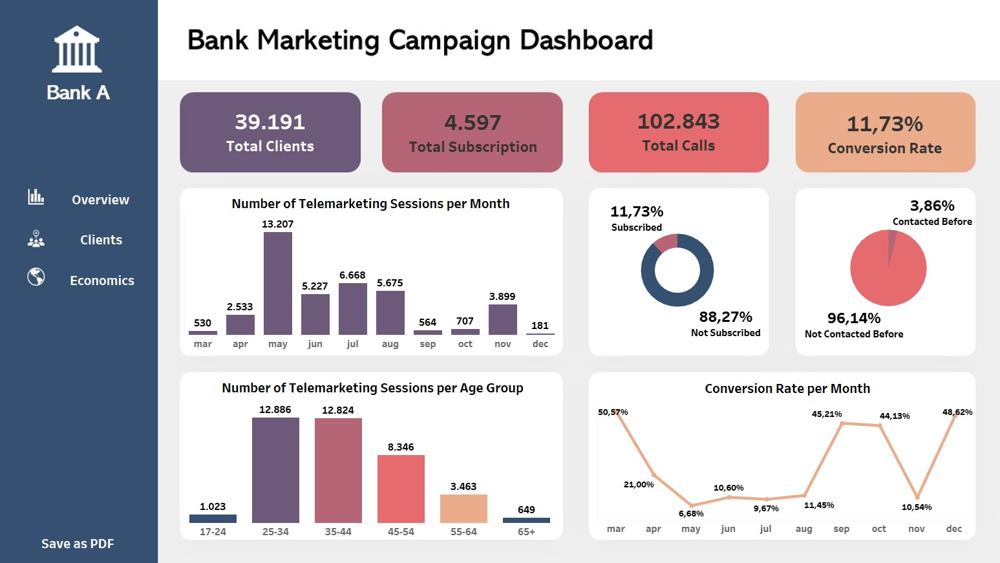
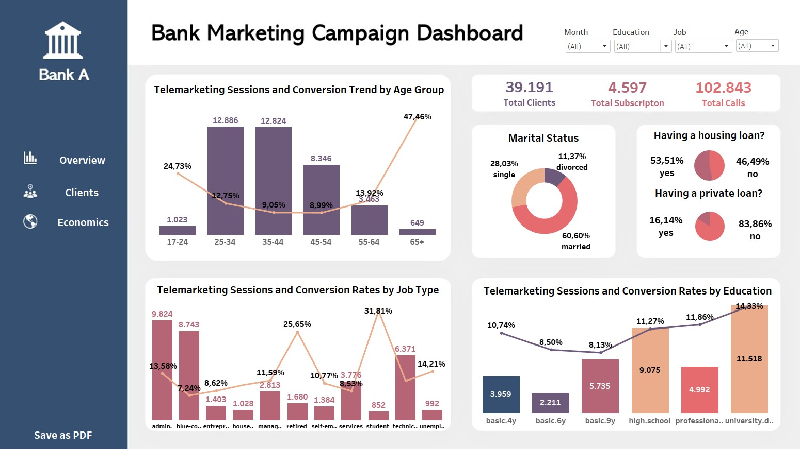
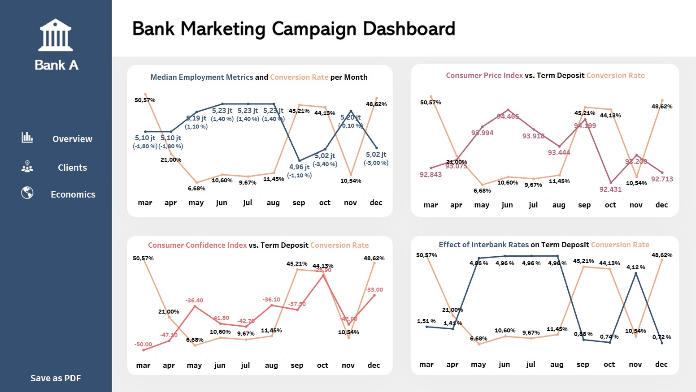
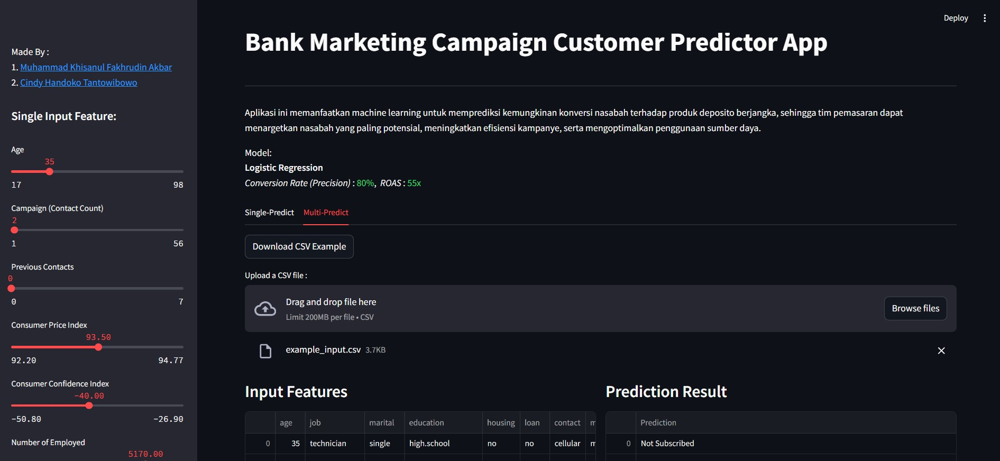

## 1. Business Understanding

Inaccuracy in targeting customer segments has become the main cause of low effectiveness in Bank A's telemarketing campaigns. Many calls are directed to segments that do not match the characteristics of the [term deposit](https://archive.ics.uci.edu/dataset/222/bank+marketing) product, resulting in highly variable conversion rates. In certain periods, campaign success rates reach over 50%, but in other periods can drop drastically to below 10%. This variation reflects that the targeting strategy used is not yet optimal and directly impacts the high operational costs of marketing.

Responding to these problems, Bank A's data analysis team developed a machine learning-based predictive model. This model is built using historical campaign data, including demographic attributes, financial status, and customer interaction history. The goal is to identify potential customers with higher conversion potential. With this approach, Bank A's marketing team can run telemarketing more efficiently, reduce resource waste, and potentially increase success rates consistently.

## 2. Goals

Improve the effectiveness of term deposit product telemarketing campaigns through the implementation of machine learning models to identify customers with high conversion potential more accurately and efficiently. The conversion target is set at 20–25% per month, exceeding the banking industry average of 14.47% [(source)](https://focus-digital.co/average-sales-call-conversion-rate-by-industry/), and will be measured starting from the first month of implementation. This target is considered realistic because historical conversions have reached up to 50%, and this approach is also designed to address challenges such as low conversion rates, lack of customer segmentation, and the need for more effective and targeted resource allocation.

## 3. Analytic Approach

* **Customer Pattern Identification**: Analyzing historical data to find characteristics that differentiate between customers who tend to accept or reject deposit offers.
* **Classification Prediction Model**: Building machine learning models to accurately identify customers with high likelihood of conversion, to improve telemarketing campaign effectiveness.

## 4. Evaluation Metric

**Cost Evaluation:**

* Opportunity Cost: The bank potentially loses around US $350 per customer per year if it fails to reach potential customers who are actually interested in deposit products. This includes lost revenue from interest and other potential business opportunities.
* Marketing Cost: To reach one potential customer, the bank spends about US $5.02, including phone calls, CRM infrastructure, and telemarketer salaries. This cost becomes a burden when directed to uninterested customers.

**Type Error:**

* False Positive (Type I Error): The model incorrectly predicts a customer will be interested when they are not. As a result, the bank incurs marketing costs (±$5.2/customer) without results, reducing campaign efficiency and profit.
* False Negative (Type II Error): The model fails to detect customers who are actually interested. As a result, the bank loses potential revenue (±$350/customer) and opportunities to expand its customer base.

**Precision** is the main metric in improving campaign conversion because it shows how accurate the model is in predicting customers who are truly interested. Focus on precision helps banks reduce wasted contact costs and improve marketing efficiency. With the formula:

$$ \text{Precision} = \frac{\text{True Positives}}{\text{True Positives} + \text{False Positives}} $$

The higher the precision, the more targeted the marketing strategy, because only potential customers are contacted. This makes every interaction more valuable and drives optimal conversion rate improvement.

## 5. Conclusions

1. **Certain Customer Profiles Show Higher Conversion Potential**
   Customers aged 25–34 years, highly educated, without personal loans, and single status are the most potential segment. Additionally, retirees with financial stability also show high conversion rates despite their small numbers.

2. **Communication media greatly influences campaign success**
   Customers are more responsive when contacted via personal mobile phones compared to home phones, because they are more personal and relevant. Contact through home phones actually reduces positive responses by about 56%, making this channel less effective as the main choice.

3. **Contact history determines conversion opportunities.**
   Customers who have been contacted before have about three times greater likelihood of responding positively compared to those who have never been contacted. Those who have been successfully converted before also have almost twice the likelihood compared to those who failed, while customers who have never been contacted show better response potential than those who failed, making them worthy new targets. Conversely, customers with a history of conversion failure tend to be the most difficult to follow up.

4. **Economic Conditions Affect Customer Response to Campaigns**
   When labor market conditions deteriorate, for example negative job growth and declining workforce, customers are actually more interested in deposits because they are considered safer. Conversely, when the workforce increases, interest in deposits tends to decline. This shows that economic uncertainty drives customers to choose more stable financial products like deposits.

5. **Machine Learning Models Can Improve Telemarketing Efficiency**
   The developed logistic regression model can increase conversion rates to 80%, far exceeding the historical average of 26%. This shows that utilizing historical data with predictive approaches can consistently improve effectiveness.

## 6. Recommendations

1. **Focus Targeting on Potential Customer Profiles**
   Create campaign segmentation based on the most responsive customer characteristics, namely:
   * Age 25–34 years
   * Higher education
   * Single status
   * No personal loans
   Prioritize this segment in call lists to improve efficiency and conversion opportunities.

2. **Optimize Effective Communication Channels**
   Use personal mobile phones as the main medium for telemarketing because they are proven more effective and personal. Reduce the use of office/home phones because they significantly reduce conversion opportunities.

3. **Manage Contact History for Follow-up Strategy**
   Prioritize follow-up to customers who have been contacted in previous periods, especially those who have been successfully converted. Avoid too many attempts on customers with repeated failure history, because their effectiveness is low.

4. **Optimize Campaign Messages According to Economic Trends to Increase Conversion**
   Adjust campaign message content with current economic conditions. When economic situation weakens, highlight the benefits of security, stability, and guaranteed results from deposit products. Conversely, when the economy begins to recover, direct messages to fund growth opportunities and product flexibility. Create adaptive telemarketing scripts and prepare dynamic campaign materials according to ongoing macroeconomic trends.

5. **Integrate Predictive Models in Telemarketing Process**
   Use the built model (logistic regression) to identify potential customers with the highest conversion probability. This can improve efficiency, reduce costs, and increase opportunities to achieve conversion rates above historical averages.

## 7. Data Sources

The [Bank Marketing Campaigns](https://www.kaggle.com/datasets/volodymyrgavrysh/bank-marketing-campaigns-dataset/data) dataset contains telemarketing campaign data over 10 months by a bank in Portugal to promote term deposit products. This dataset includes 21 columns and records customer information, interaction history, and macroeconomic indicators. The columns are divided into 5 groups:

1. **Client Information (7 columns)** – demographic and financial customer data
2. **Contact Details (5 columns)** – communication time and methods
3. **Campaign History (4 columns)** – frequency and results of previous contacts
4. **Economic Indicators (4 columns)** – macro data such as interest rates and unemployment
5. **Target (1 column)** – y, whether the customer accepts the deposit offer

## 8. Project Structure

```
├── README.md         
|
├── data
│   ├── bank-additional-full.csv
|   |── bank_marketing_imptn.csv
|   |── example_input_stremlit.csv
│   └── bank_marketing_clean.csv
│
├── model          
│   ├── logreg_for_marketing_2.sav (80% Precision)
│   └── logreg_for_marketing.sav
│
├── notebook          
│   └──Bank_marketing.ipynb
│
├── reports            
│   └── Bank Marketing Campaign Dashboard.twbx
│
├── streamlit
|   |── function.py
│   └── main.py
│
└── requirements.txt
```

## 9. Tableau Dashboard

The [Tableau Bank Marketing Campaign](https://public.tableau.com/app/profile/khisanul.fakhrudin/viz/BankMarketingCampaignDashboard_17525804810670/Overview) dashboard presents interactive visualizations to analyze the effectiveness of deposit product telemarketing campaigns. The dashboard includes customer profiles, campaign performance, and conversion insights, which help in understanding customer response patterns and identifying segments with the highest conversion potential.

* Overview Pages


* Clients Pages


* Economics Pages


## 10. Streamlit App Overview

The [Bank Marketing Campaign Customer Predictor Application](https://finpro-bank-marketing.streamlit.app/) is developed using Streamlit as an interactive interface to demonstrate machine learning model results in predicting customer interest in term deposit products. This application allows users to input data directly through the sidebar panel or through CSV file uploads in large quantities (batch prediction). After data is entered, the application will display prediction results in an easy-to-understand format.

* Streamlit Pages


* Batch prediction example


## 11. Installation

* Requirements:
  * Python 3.13 or higher
  * Jupyter Notebook

* Installation:
```bash
git clone https://github.com/avotoast-zip/ML_for_Term_Deposit_Telemarketing
cd ML_for_Term_Deposit_Telemarketing
pip install -r requirements.txt
```

* Run Analysis:
  * Make sure required libraries are installed in the environment
  * Open the Bank_marketing.ipynb file in the notebook folder

## 12. Contact

* Name: Muhammad Khisanul Fakhrudin Akbar
* Email: shinaruikhisan@gmail.com
* LinkedIn: https://www.linkedin.com/in/muhammad-khisanul-fakhrudin-akbar/

* Name: Cindy Handoko Tantowibowo
* Email: cindyhtantowibowo@gmail.com
* LinkedIn: https://www.linkedin.com/in/cindy-handoko-tantowibowo-55a2751a7/